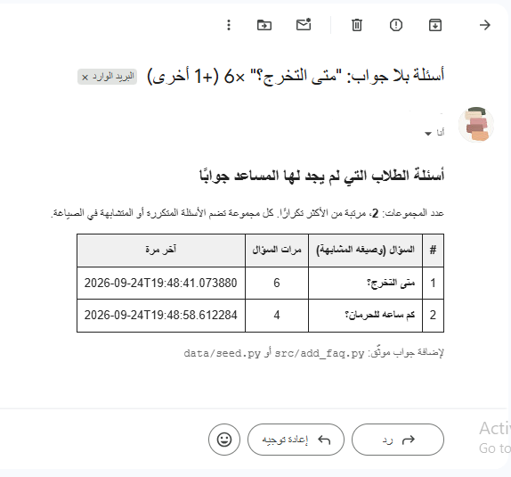
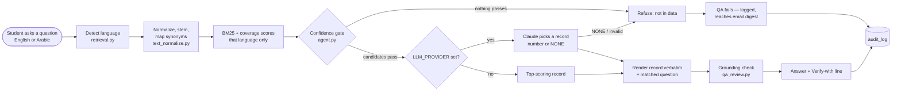
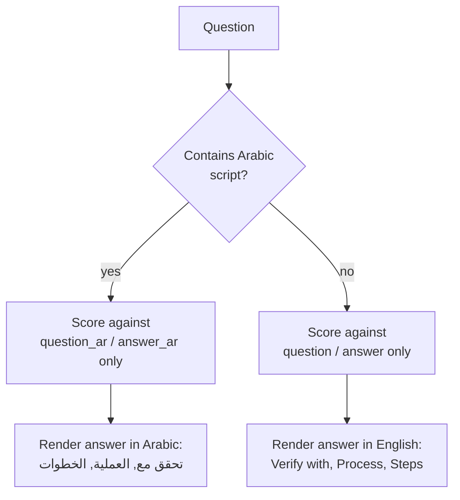

# Academic Process Copilot

**[Try the live demo](https://claude.ai/artifact/RoG7a6vctw8WuAG4gDL1g6)** — a standalone in-browser copy, no setup required. It runs an earlier version of the retrieval logic (before the normalization and confidence gate described below), and questions asked there are not logged and never reach the staff email digest — that loop runs through the API (`POST /ask`).

An AI-assisted institutional process assistant: a student (or advisor) asks
a question about a university procedure — in English **or Arabic** — and a
structured-prompting agent retrieves and answers in that same language
from a verified database, guides them through the required steps
and forms, and refuses to guess when the data doesn't cover the question.
A second module applies the same structured-prompting + QA pattern to
drafting and reviewing academic materials.

Built specifically to demonstrate every capability an
**AI-Enabled Academic and Administrative Support IT Technician** role
requires — this README maps each requirement to exactly where it's
implemented, so nothing has to be taken on faith.

> **Real regulatory data, not a mockup.** Every process, step, and FAQ in
> `data/seed.py` is sourced from the actual UTAS Academic Regulation
> (Decision No. 612/2022, Official Gazette No. 1468) — 14 processes and
> 28 FAQs, each citing the specific article it comes from. This covers
> the most commonly-asked regulations (registration, withdrawal,
> probation, deferral, training, graduation, appeals, transfers) rather
> than the full 92-article text — a curated FAQ set works from discrete
> question/answer pairs matching what students actually ask, not a raw
> legal-text dump. Extend `data/seed.py` with more FAQs (same structure,
> citing the article number) for anything not yet covered.

## Contents

- [Full project guide](docs/GUIDE.md) — comprehensive walkthrough (setup, usage, every design decision)
- [Screenshots](#screenshots)
- [Quick start](#quick-start)
- [Requirement → implementation map](#requirement--implementation-map)
- [Architecture](#architecture)
- [RAG design](#rag-design-why-this-counts-as-grounded-not-just-has-an-llm-call)
- [Evaluation](#evaluation-measured-not-claimed)
- [No-code automation layer](#no-code-automation-layer)
- [Bilingual design](#bilingual-design-arabic-and-english-not-translation-after-the-fact)
- [Honest limitations](#honest-limitations)

## Screenshots

Real output from this project running — not mockups. See `docs/screenshots/`
for the full-resolution files.

**Automated tests passing** (`demo/test_qa_review.py`), including the case
designed to fail (a missing checklist item) actually failing:


**The n8n automation layer correctly escalating** a question outside the
data ("what is the weather today") instead of guessing:


**Both n8n flows executed successfully in one run** — student inquiry
(top) and the unanswered-questions digest (bottom), every node green:


**The API's health endpoint**, live:


**n8n workflow 1 (Webhook: student inquiry) — the actual canvas:**


**n8n workflow 2 (scheduled digest) — the actual canvas:**


**A correctly escalated question** (outside the data, no guess made):


**Similar unanswered questions grouped and emailed to staff automatically**
(`GET /admin/unanswered/grouped` → n8n digest → email), so each gap is
reported once with all its phrasings, not once per wording:



## Quick start

```bash
pip install -r requirements.txt   # rank_bm25 for retrieval, fastapi/uvicorn for the API
python data/seed.py               # builds data/institutional_processes.db
python demo/demo.py               # runs both flows end to end (CLI)
python demo/test_qa_review.py     # QA layer tests, including failure cases
python demo/test_bilingual.py     # Arabic + English retrieval/generation tests
python demo/test_gap_grouping.py  # grouping of similar unanswered questions
python demo/test_understanding.py # paraphrases understood, out-of-scope refused
python demo/test_llm_selection.py # the LLM may pick a record, never write text
python demo/eval_retrieval.py     # accuracy / refusal numbers on labeled questions
uvicorn src.api:app --reload      # runs the API — open http://127.0.0.1:8000/docs
```

Try it in either language via the API:

```bash
curl -X POST http://127.0.0.1:8000/ask -H "Content-Type: application/json" \
  -d '{"question": "What GPA puts me on academic probation?"}'

curl -X POST http://127.0.0.1:8000/ask -H "Content-Type: application/json" \
  -d '{"question": "أي معدل يخليني تحت الملاحظة الأكاديمية؟"}'
```

Or with Docker: `docker build -t apc . && docker run -p 8000:8000 apc`

Runs fully offline by default (no API key needed). Setting
`LLM_PROVIDER=anthropic` and `ANTHROPIC_API_KEY` adds Claude as a second
judge of *which* verified record answers the question — it never writes the
answer; see `src/agent.py::_llm_select`.

Every push to `main` runs the test suite automatically via GitHub Actions
(`.github/workflows/tests.yml`).

## Requirement → implementation map

| Job description requirement | Where it's implemented |
|---|---|
| Develop, organize and maintain structured academic resources in line with curriculum frameworks and quality standards | `src/materials.py`, `src/prompts/templates.py::MATERIAL_REVIEW_TEMPLATE` (curriculum requirements + quality checklist are explicit inputs) |
| Apply AI-assisted tools and structured prompts to develop, refine and review academic materials within agreed guidelines | `src/materials.py::draft_and_review()`, `src/prompts/templates.py` |
| Support academic teams in consistent review, verification and quality assurance processes | `src/qa_review.py`, `docs/QA_PROCESS.md`, `src/add_faq.py` + `GET /admin/unanswered` (closes the loop on gaps the QA layer finds), `GET /admin/unanswered/grouped` + `src/gap_grouping.py` (similar phrasings of one gap merged and emailed to staff), `GET /admin/kpi` (one aggregated health view: pass rate, top gaps, stale-data count, coverage) |
| Build and maintain databases and repositories covering institutional stakeholders and academic operations | `data/seed.py` (schema + seed), `src/db.py` |
| Design AI-assisted workflows and agents that reduce repetitive administrative work and guide users through forms and institutional processes | `src/agent.py::answer_question()`, Demo 1 in `demo/demo.py` |
| Work with academic and administrative staff to identify where AI and digital tools can improve existing processes | `docs/PROCESS_IMPROVEMENT_ANALYSIS.md` |
| Provide technical support for implementing and improving AI-enabled institutional solutions | `src/api.py` (deployable FastAPI service, auto-generated docs at `/docs`), `Dockerfile`, `.github/workflows/tests.yml` (CI) |
| Demonstrated use of generative AI tools in a professional/academic setting | Whole project; pluggable LLM call in `src/agent.py::_call_llm` |
| Sound understanding of structured prompting for information processing and workflow support | `src/prompts/templates.py` — fixed role, verified context, explicit output format and guardrails, not a free-form instruction; `SELECTION_TEMPLATE` restricts the model to choosing a record number or NONE; `src/retrieval.py` + `src/qa_review.py::check_grounding()` form a real RAG pipeline — retrieval and a tested anti-hallucination check, not just a prompt instruction (see "RAG design" below) |
| Strong digital literacy across databases, spreadsheets and online platforms | SQLite schema design (`data/seed.py`), CLI tooling |
| Minimum 2 years' experience; **or** strong graduate with demonstrable AI projects | This project is that evidence |
| AI agents, workflow automation, or no-code/low-code platforms | `src/agent.py` (code-based agent) **and** `automation/apc-student-inquiry.n8n.json` + `automation/apc-daily-digest.n8n.json` — real, importable n8n no-code workflows that orchestrate the API, including a scheduled email digest (see `automation/README.md`) |
| Database design and data management | `data/seed.py` schema (5 normalized tables, foreign keys, seed data) |
| University, educational environment | Domain of the whole project |
| Quality assurance and structured documentation processes | `docs/QA_PROCESS.md`, `src/qa_review.py`, tests in `demo/test_qa_review.py` |
| Data protection, information security and responsible AI use | `docs/RESPONSIBLE_AI_AND_SECURITY.md`, `src/security.py`, `src/audit_log.py` (logs question + QA outcome only — never the generated answer or any PII), `src/qa_review.py::check_grounding()` (verifies the answer's numbers/citations actually came from the retrieved data) |

## Architecture



```
data/seed.py        → builds institutional_processes.db from the real
                       UTAS Academic Regulation (processes, steps, FAQs,
                       each citing a specific article)
src/db.py            → read layer (get_conn, per-process step/form lookups,
                        get_process() for direct id lookups)
src/text_normalize.py → Arabic/English normalization, light stemming, citation
                        stripping and a curated synonym table — applied
                        identically to questions and documents
src/retrieval.py      → RAG retrieval: BM25 over FAQs + processes, with a
                        minimum-shared-terms guard against single-rare-
                        word false positives (see "RAG design" below) —
                        and language-aware: detect_language() routes each
                        query to an Arabic- or English-only scored index
                        (see "Bilingual design" below)
src/prompts/         → structured prompt templates (the "how" of the AI use)
src/agent.py          → route_question(): confidence gate (and optional LLM
                        selection) decides which ONE record may answer, or
                        refuses → answer rendered verbatim → grounding
                        check → log → return (answer, prompt, qa_passed)
src/materials.py      → material drafting/refinement flow, same pattern
src/qa_review.py      → automated QA checks, including check_grounding()
                        — verifies every number/article citation in the
                        answer actually appears in the retrieved context
src/security.py       → prompt-injection stripping, PII redaction, RBAC stub
src/audit_log.py      → logs every question + match + QA outcome (no PII, no answer text)
src/gap_grouping.py   → merges similar phrasings of the same unanswered
                        question (Arabic + English normalization) so staff
                        see one gap, not ten wordings of it
src/freshness_check.py→ flags FAQ rows not re-verified within 180 days
src/add_faq.py         → adds one verified FAQ without wiping the database
                        or audit history — how staff close a gap
src/api.py            → FastAPI service (POST /ask, POST /materials/draft,
                        GET /health, GET /admin/freshness, GET /admin/unanswered,
                        GET /admin/unanswered/grouped, GET /admin/kpi)
                        — auto-documented at /docs
Dockerfile             → containerized deployment
.github/workflows/     → CI: installs requirements.txt, then runs the full
                        test suite on every push
demo/demo.py          → runs both flows, prints every stage (nothing hidden)
demo/test_qa_review.py→ QA tests, including a simulated hallucination
                        (an invented number/article) that must be caught
demo/eval_questions.py→ labeled questions: DEV (used for tuning) and
                        HELDOUT (written before tuning, never edited)
demo/eval_retrieval.py→ measures accuracy, wrong-topic, missed and
                        false-answer rates; CI enforces the held-out floors
docs/                 → QA process, responsible-AI/security policy,
                        process-improvement analysis
```

## RAG design: why this counts as "grounded," not just "has an LLM call"

Two separate things can go wrong in a retrieval-augmented system, and this
project addresses both with a testable check — not just a prompt
instruction the model could ignore:

**1. Retrieval can return the wrong document.** `src/retrieval.py` uses
BM25 (sparse, term-frequency ranking) instead of the earlier per-keyword
loop, which fixed a real bug found in testing: `"late"` matching inside
`"calculated"` through substring search. BM25 also requires a minimum
number of *distinct* shared terms between the query and a document (not
just a high weighted score), which fixed a second real bug: a query
entirely absent from the data (`"library late fee for overdue books"`)
was still scoring one process highly through a single coincidental rare-
word match (`"fee"` appearing once in an unrelated FAQ). Both fixes are
covered by the test at the top of `demo/demo.py`'s development history —
see the commit-equivalent notes inline in `src/retrieval.py`.

**1b. The question may not be understood, or may not be in the data at
all.** Plain BM25 only matches identical words: "متى يصل الطالب للحرمان؟"
returned "not found" although FAQ 9 answers it (the FAQ says "أُحرم"), and
"How many credit hours do I need before applying for OJT?" was answered
confidently from an unrelated FAQ about course load. Two changes address
this. `src/text_normalize.py` normalizes Arabic spelling variants, strips
common prefixes/suffixes, removes article citations before scoring, and
maps same-meaning words to one concept through a small hand-written table.
Then a **confidence gate** in `src/agent.py::route_question` only lets a
record answer if it shares enough of the question's terms (≥2 terms and
≥60% coverage, counting words that appear nowhere in the data against
it); otherwise the agent refuses and the question becomes a logged gap.
Every answer starts with the verified question it was matched to, so a
misunderstanding is visible to the student rather than silent.

**2. Generation can drift beyond what was retrieved**, even when
retrieval was correct — this is what "hallucination" actually means in a
RAG system. This project removes free-text generation from the answer
path entirely: with or without an LLM, the student sees a database record
copied verbatim. When `LLM_PROVIDER` is set, the model only chooses
between gated candidates (reply = a number or NONE); anything else it
returns is treated as NONE, which `demo/test_llm_selection.py` checks with
a stubbed model that tries to answer in prose. The grounding check below
stays as a second line of defense. `src/qa_review.py::check_grounding()`
inspects the *output*: it extracts every number and article citation the
answer states and verifies each one actually appears in the context that
was retrieved. `demo/test_qa_review.py::test_flags_ungrounded_number`
proves this catches a deliberately fabricated example (a wrong GPA
threshold and an invented "Article 99") — not just a well-formed answer
that happens to be correct by construction.

**What remains, stated rather than hidden:** because no answer text is
generated, invented facts cannot appear in an answer. The remaining risk
is *choosing the wrong record* — a verbatim, correct regulation that
answers a different question. That is what the evaluation below measures.

## Evaluation: measured, not claimed

`demo/eval_retrieval.py` runs labeled questions through the same routing
the API uses. `demo/eval_questions.py` holds two sets written by the
author: **DEV** (35 in-scope, 9 out-of-scope) was used to tune the
normalization, synonym table and gate; **HELDOUT** (22 in-scope, 12
out-of-scope) was written before any tuning and never edited, so it is
the honest number. The same script was run on the code before this
change for comparison.

| HELDOUT (22 in-scope / 12 out-of-scope) | Before | After |
|---|---|---|
| Answered from exactly the right FAQ | 17/22 | 19/22 |
| Answered from the right process (incl. a sibling FAQ) | 18/22 | 20/22 |
| Answered from an unrelated topic | 1/22 | 0/22 |
| Refused although answerable (becomes a staff gap) | 3/22 | 2/22 |
| Out-of-scope question answered instead of refused | 1/12 | 2/12 |

On DEV the in-scope misses dropped from 11/35 to 0/35 and the OJT
question is now refused — but DEV was used for tuning, so treat that as
an upper bound. The two held-out false answers are "هل فيه باص بين
الفروع؟" (a bus between branches — matched the branch-transfer process
through "branches") and "How many credit hours do I need to start my
graduation project?" (matched course-load rules, as before). The sets are small and author-written, so
these are indicators, not statistically strong results; real student
questions from `audit_log` are the next evaluation set to build. CI
fails if a change makes the held-out numbers worse.

## No-code automation layer

Two real, importable n8n workflows in `automation/` — not just a
description of one. `apc-student-inquiry.n8n.json` calls this API's
`/ask` endpoint per question and escalates instead of guessing;
`apc-daily-digest.n8n.json` calls `/admin/unanswered/grouped` on a
schedule and emails staff one summary of the unanswered questions that
were asked repeatedly — similar phrasings merged into one row — instead
of one alert per failure. It stays silent on days with nothing new. The
email body is built by the Code node in `automation/build_email_body.js`;
sending requires an SMTP credential added in n8n after import (never
stored in the workflow file). See `automation/README.md` for what each
workflow does, how to run them, and why there are two instead of one.

## Bilingual design: Arabic and English, not translation-after-the-fact



A student can ask in either language and gets an answer in that same
language — but this isn't a translation layer bolted on at the end.
`src/retrieval.py::detect_language()` checks the question for Arabic
script and routes it to a BM25 index built **only from that language's**
text (`question_ar`/`answer_ar` vs `question`/`answer`, etc.) — an Arabic
question can only match Arabic-scored content, and vice versa. The
offline fallback and structured prompt then render fully in that
language: labels included ("تحقق مع" not "Verify with"), not just the
underlying facts. `src/qa_review.py`'s grounding check was also extended
to recognize Arabic article citations ("المادة 46") alongside English
ones, so a hallucinated Arabic answer is caught exactly the same way an
English one is.

Building this surfaced a real bug, covered by
`demo/test_bilingual.py::test_process_narrowing_fetches_correct_process_even_if_not_in_candidates`:
an Arabic query's top-matched FAQ correctly pointed at the right process
via its `process_id`, but that process hadn't itself scored into the
initial BM25 candidate list (a different, unrelated process had, on
coincidental shared terms). The old narrowing logic only filtered
already-retrieved candidates and silently kept the wrong one when the
right one wasn't among them — fixed by fetching the FAQ's linked process
directly by id (`db.py::get_process()`) instead of only filtering.

**What isn't bilingual (yet), stated rather than hidden**: the academic
material drafting module (`src/materials.py`) and the published
client-side demo artifact are English-only. `src/add_faq.py` accepts an
optional Arabic translation for newly-added FAQs — an FAQ added without
one simply won't surface for Arabic questions until translated, rather
than showing a blank or English-only answer to an Arabic query.

## Honest limitations

- Understanding is lexical (BM25 + normalization + a curated synonym
  table), not semantic. Words nobody put in the synonym table still miss,
  and adding FAQs on a new topic may need new table entries. The most
  common error is choosing a sibling FAQ in the right process ("how many
  withdrawals" answered with "withdrawal deadline"); answers list the
  process's other questions so the student can re-ask. A multilingual
  embedding model would likely help with both, at the cost of a large
  dependency (PyTorch) and a model download — not added yet, so no claim
  is made about it. See "Evaluation" above for the measured error rates.

  Before the confidence gate, the OJT question below was answered from an
  unrelated course-load FAQ (screenshot from that version, via n8n). It
  is now refused, which `demo/test_understanding.py` checks:
  
- Grouping of unanswered questions (`src/gap_grouping.py`) is lexical —
  shared words after Arabic/English normalization — not semantic. Two
  phrasings of the same gap with no words in common ("library late fee"
  vs "overdue book penalty") are reported as separate rows. The email
  digest only runs while n8n and the API are both running.
- No admin UI yet — data is edited via script, not a form; `GET
  /admin/freshness` surfaces what needs re-verification, but re-verifying
  is still a manual step.
- Answers are verbatim database records, not natural rephrased text. That
  is the price of "no generated text": predictable and auditable, but less
  conversational, and one answer cannot combine two FAQs.
- Re-running `data/seed.py` deletes and rebuilds the database, including
  the audit log of unanswered questions. Use `src/add_faq.py` to add an
  answer without losing that history.
- The live demo has not been updated to the gated retrieval.
- The API has no authentication layer — `src/security.py::check_access` is
  a stub; a real deployment would sit it behind the institution's SSO.
