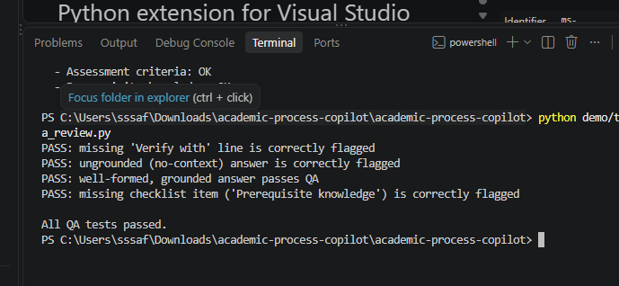
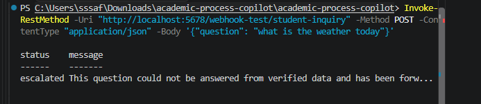
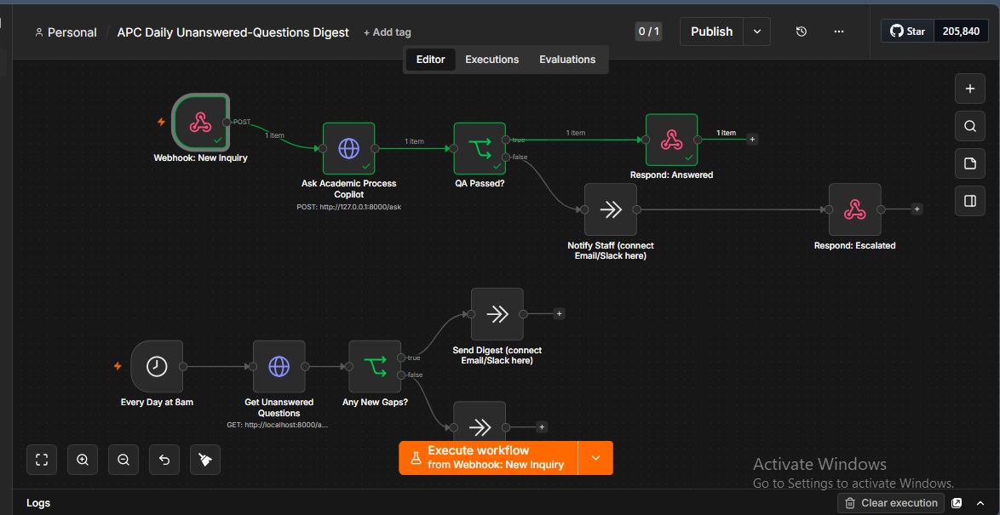
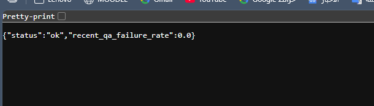
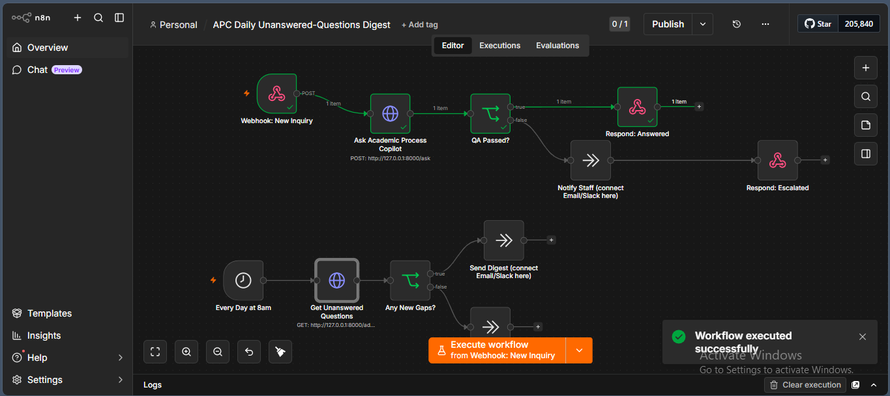
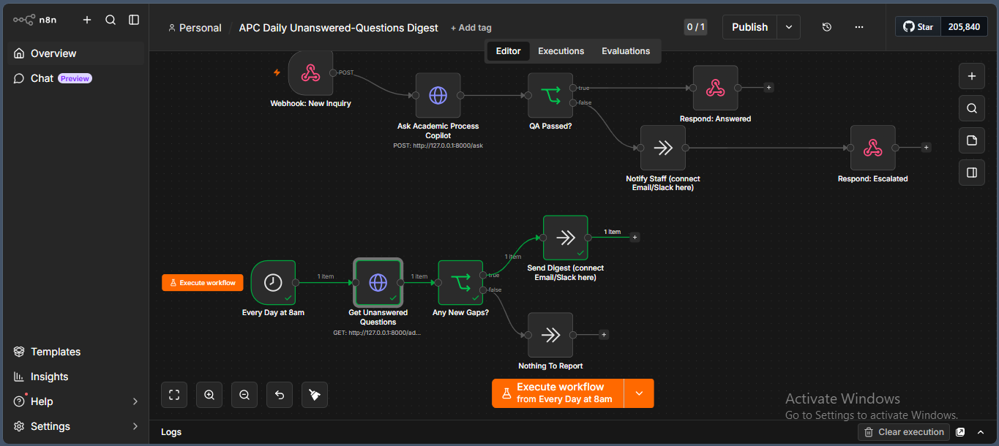
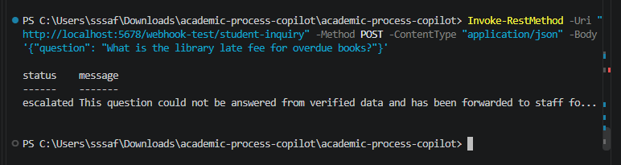
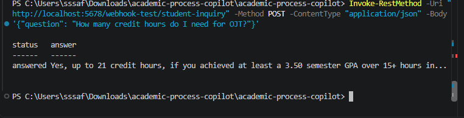

# Academic Process Copilot

**[Try the live demo](https://claude.ai/artifact/RoG7a6vctw8WuAG4gDL1g6)** — runs the same retrieval, structured-prompt and QA logic in the browser, no setup required.

An AI-assisted institutional process assistant: a student (or advisor) asks
a question about a university procedure — in English **or Arabic** — and a
structured-prompting agent retrieves and answers in that same language
from a verified database, guides them through the required steps
and forms, and refuses to guess when the data doesn't cover the question.
A second module applies the same structured-prompting + QA pattern to
drafting and reviewing academic materials.

Built specifically to demonstrate every capability an
**AI-Enabled Academic and Administrative Support IT Technician** role
requires — this README maps each requirement to exactly where it's
implemented, so nothing has to be taken on faith.

> **Real regulatory data, not a mockup.** Every process, step, and FAQ in
> `data/seed.py` is sourced from the actual UTAS Academic Regulation
> (Decision No. 612/2022, Official Gazette No. 1468) — 14 processes and
> 28 FAQs, each citing the specific article it comes from. This covers
> the most commonly-asked regulations (registration, withdrawal,
> probation, deferral, training, graduation, appeals, transfers) rather
> than the full 92-article text — a curated FAQ set works from discrete
> question/answer pairs matching what students actually ask, not a raw
> legal-text dump. Extend `data/seed.py` with more FAQs (same structure,
> citing the article number) for anything not yet covered.

## Contents

- [Full project guide](docs/GUIDE.md) — comprehensive walkthrough (setup, usage, every design decision)
- [Screenshots](#screenshots)
- [Quick start](#quick-start)
- [Requirement → implementation map](#requirement--implementation-map)
- [Architecture](#architecture)
- [RAG design](#rag-design-why-this-counts-as-grounded-not-just-has-an-llm-call)
- [No-code automation layer](#no-code-automation-layer)
- [Bilingual design](#bilingual-design-arabic-and-english-not-translation-after-the-fact)
- [Honest limitations](#honest-limitations)

## Screenshots

Real output from this project running — not mockups. See `docs/screenshots/`
for the full-resolution files.

**Automated tests passing** (`demo/test_qa_review.py`), including the case
designed to fail (a missing checklist item) actually failing:

**The n8n automation layer correctly escalating** a question outside the
data ("what is the weather today") instead of guessing:

**Both n8n flows executed successfully in one run** — student inquiry
(top) and the unanswered-questions digest (bottom), every node green:

**The API's health endpoint**, live:

**n8n workflow 1 (Webhook: student inquiry) — the actual canvas:**

**n8n workflow 2 (scheduled digest) — the actual canvas:**

**A correctly answered question**, via the live n8n webhook:

**A correctly escalated question** (outside the data, no guess made):

## Quick start

\`\`\`bash
pip install -r requirements.txt   # rank_bm25 for retrieval, fastapi/uvicorn for the API
python data/seed.py               # builds data/institutional_processes.db
python demo/demo.py               # runs both flows end to end (CLI)
python demo/test_qa_review.py     # QA layer tests, including failure cases
python demo/test_bilingual.py     # Arabic + English retrieval/generation tests
uvicorn src.api:app --reload      # runs the API — open http://127.0.0.1:8000/docs
\`\`\`

Try it in either language via the API:

\`\`\`bash
curl -X POST http://127.0.0.1:8000/ask -H "Content-Type: application/json" \\
  -d '{"question": "What GPA puts me on academic probation?"}'

curl -X POST http://127.0.0.1:8000/ask -H "Content-Type: application/json" \\
  -d '{"question": "أي معدل يخليني تحت الملاحظة الأكاديمية؟"}'
\`\`\`

Or with Docker: `docker build -t apc . && docker run -p 8000:8000 apc`

Runs fully offline by default (no API key needed) using a deterministic
template fallback — set `LLM_PROVIDER=anthropic` and `ANTHROPIC_API_KEY`
to route through a real model instead; see `src/agent.py::_call_llm`.

Every push to `main` runs the test suite automatically via GitHub Actions
(`.github/workflows/tests.yml`).

## Requirement → implementation map

| Job description requirement | Where it's implemented |
|---|---|
| Develop, organize and maintain structured academic resources in line with curriculum frameworks and quality standards | `src/materials.py`, `src/prompts/templates.py::MATERIAL_REVIEW_TEMPLATE` (curriculum requirements + quality checklist are explicit inputs) |
| Apply AI-assisted tools and structured prompts to develop, refine and review academic materials within agreed guidelines | `src/materials.py::draft_and_review()`, `src/prompts/templates.py` |
| Support academic teams in consistent review, verification and quality assurance processes | `src/qa_review.py`, `docs/QA_PROCESS.md`, `src/add_faq.py` + `GET /admin/unanswered` (closes the loop on gaps the QA layer finds), `GET /admin/kpi` (one aggregated health view: pass rate, top gaps, stale-data count, coverage) |
| Build and maintain databases and repositories covering institutional stakeholders and academic operations | `data/seed.py` (schema + seed), `src/db.py` |
| Design AI-assisted workflows and agents that reduce repetitive administrative work and guide users through forms and institutional processes | `src/agent.py::answer_question()`, Demo 1 in `demo/demo.py` |
| Work with academic and administrative staff to identify where AI and digital tools can improve existing processes | `docs/PROCESS_IMPROVEMENT_ANALYSIS.md` |
| Provide technical support for implementing and improving AI-enabled institutional solutions | `src/api.py` (deployable FastAPI service, auto-generated docs at `/docs`), `Dockerfile`, `.github/workflows/tests.yml` (CI) |
| Demonstrated use of generative AI tools in a professional/academic setting | Whole project; pluggable LLM call in `src/agent.py::_call_llm` |
| Sound understanding of structured prompting for information processing and workflow support | `src/prompts/templates.py` — fixed role, verified context, explicit output format and guardrails, not a free-form instruction; `src/retrieval.py` + `src/qa_review.py::check_grounding()` form a real RAG pipeline — retrieval and a tested anti-hallucination check, not just a prompt instruction (see "RAG design" below) |
| Strong digital literacy across databases, spreadsheets and online platforms | SQLite schema design (`data/seed.py`), CLI tooling |
| Minimum 2 years' experience; **or** strong graduate with demonstrable AI projects | This project is that evidence |
| AI agents, workflow automation, or no-code/low-code platforms | `src/agent.py` (code-based agent) **and** `automation/apc-student-inquiry.n8n.json` — a real, importable n8n no-code workflow that orchestrates the API (see `automation/README.md`) |
| Database design and data management | `data/seed.py` schema (5 normalized tables, foreign keys, seed data) |
| University, educational environment | Domain of the whole project |
| Quality assurance and structured documentation processes | `docs/QA_PROCESS.md`, `src/qa_review.py`, tests in `demo/test_qa_review.py` |
| Data protection, information security and responsible AI use | `docs/RESPONSIBLE_AI_AND_SECURITY.md`, `src/security.py`, `src/audit_log.py` (logs question + QA outcome only — never the generated answer or any PII), `src/qa_review.py::check_grounding()` (verifies the answer's numbers/citations actually came from the retrieved data) |

## Architecture

\`\`\`mermaid
flowchart LR
    Student([Student asks a question English or Arabic]) --> Detect[Detect language retrieval.py]
    Detect --> Retrieve[BM25 retrieval scored in that language only]
    Retrieve --> Prompt[Build structured prompt prompts/templates.py]
    Prompt --> LLM{LLM_PROVIDER set?}
    LLM -->|yes| RealLLM[Call Claude / Gemini / OpenAI]
    LLM -->|no| Offline[Deterministic offline template fallback]
    RealLLM --> Ground[Grounding check qa_review.py]
    Offline --> Ground
    Ground -->|numbers/citations all supported| Pass[Answer + Verify-with line]
    Ground -->|unsupported claim found| Fail[QA fails — logged, surfaced as a gap]
    Pass --> Audit[(audit_log)]
    Fail --> Audit
\`\`\`

\`\`\`
data/seed.py        → builds institutional_processes.db from the real
                       UTAS Academic Regulation (processes, steps, FAQs,
                       each citing a specific article)
src/db.py            → read layer (get_conn, per-process step/form lookups,
                        get_process() for direct id lookups)
src/retrieval.py      → RAG retrieval: BM25 over FAQs + processes, with a
                        minimum-shared-terms guard against single-rare-
                        word false positives (see "RAG design" below) —
                        and language-aware: detect_language() routes each
                        query to an Arabic- or English-only scored index
                        (see "Bilingual design" below)
src/prompts/         → structured prompt templates (the "how" of the AI use)
src/agent.py          → process-guidance flow: retrieve → build prompt →
                        call LLM (or offline fallback) → verify grounding
                        → return (answer, prompt, qa_passed)
src/materials.py      → material drafting/refinement flow, same pattern
src/qa_review.py      → automated QA checks, including check_grounding()
                        — verifies every number/article citation in the
                        answer actually appears in the retrieved context
src/security.py       → prompt-injection stripping, PII redaction, RBAC stub
src/audit_log.py      → logs every question + match + QA outcome (no PII, no answer text)
src/freshness_check.py→ flags FAQ rows not re-verified within 180 days
src/add_faq.py         → adds one verified FAQ without wiping the database
                        or audit history — how staff close a gap
src/api.py            → FastAPI service (POST /ask, POST /materials/draft,
                        GET /health, GET /admin/freshness, GET /admin/unanswered,
                        GET /admin/kpi)
                        — auto-documented at /docs
Dockerfile             → containerized deployment
.github/workflows/     → CI: installs requirements.txt, then runs the full
                        test suite on every push
demo/demo.py          → runs both flows, prints every stage (nothing hidden)
demo/test_qa_review.py→ QA tests, including a simulated hallucination
                        (an invented number/article) that must be caught
docs/                 → QA process, responsible-AI/security policy,
                        process-improvement analysis
\`\`\`

## RAG design: why this counts as "grounded," not just "has an LLM call"

Two separate things can go wrong in a retrieval-augmented system, and this
project addresses both with a testable check — not just a prompt
instruction the model could ignore:

**1. Retrieval can return the wrong document.** `src/retrieval.py` uses
BM25 (sparse, term-frequency ranking) instead of the earlier per-keyword
loop, which fixed a real bug found in testing: `"late"` matching inside
`"calculated"` through substring search. BM25 also requires a minimum
number of *distinct* shared terms between the query and a document (not
just a high weighted score), which fixed a second real bug: a query
entirely absent from the data (`"library late fee for overdue books"`)
was still scoring one process highly through a single coincidental rare-
word match (`"fee"` appearing once in an unrelated FAQ). Both fixes are
covered by the test at the top of `demo/demo.py`'s development history —
see the commit-equivalent notes inline in `src/retrieval.py`.

**2. Generation can drift beyond what was retrieved**, even when
retrieval was correct — this is what "hallucination" actually means in a
RAG system, and it's the part a prompt instruction alone can't guarantee
against for a real LLM call. `src/qa_review.py::check_grounding()`
inspects the *output*: it extracts every number and article citation the
answer states and verifies each one actually appears in the context that
was retrieved. `demo/test_qa_review.py::test_flags_ungrounded_number`
proves this catches a deliberately fabricated example (a wrong GPA
threshold and an invented "Article 99") — not just a well-formed answer
that happens to be correct by construction.

**What this doesn't catch, on purpose stated rather than hidden:**
fabricated *prose* that introduces no checkable number or citation (an
invented reason, stated fluently) isn't caught by this check — that would
need an entailment/fact-check model or a second LLM pass, which is out of
scope for this project. The offline fallback mode is inherently immune to
this failure mode since it only ever echoes retrieved text verbatim; the
grounding check matters specifically for the real-LLM path
(`LLM_PROVIDER=anthropic`), where a model could paraphrase in a way that
drifts from the source.

## No-code automation layer

Two real, importable n8n workflows in `automation/` — not just a
description of one. `apc-student-inquiry.n8n.json` calls this API's
`/ask` endpoint per question and escalates instead of guessing;
`apc-daily-digest.n8n.json` batches unanswered questions into one daily
summary instead of one alert per failure. See `automation/README.md` for
what each does, how to run them, and why there are two instead of one.

## Bilingual design: Arabic and English, not translation-after-the-fact

\`\`\`mermaid
flowchart TD
    Q[Question] --> D{Contains Arabic script?}
    D -->|yes| ArIndex[Score against question_ar / answer_ar only]
    D -->|no| EnIndex[Score against question / answer only]
    ArIndex --> ArAnswer[Render answer in Arabic: تحقق مع, العملية, الخطوات]
    EnIndex --> EnAnswer[Render answer in English: Verify with, Process, Steps]
\`\`\`

A student can ask in either language and gets an answer in that same
language — but this isn't a translation layer bolted on at the end.
`src/retrieval.py::detect_language()` checks the question for Arabic
script and routes it to a BM25 index built **only from that language's**
text (`question_ar`/`answer_ar` vs `question`/`answer`, etc.) — an Arabic
question can only match Arabic-scored content, and vice versa. The
offline fallback and structured prompt then render fully in that
language: labels included ("تحقق مع" not "Verify with"), not just the
underlying facts. `src/qa_review.py`'s grounding check was also extended
to recognize Arabic article citations ("المادة 46") alongside English
ones, so a hallucinated Arabic answer is caught exactly the same way an
English one is.

Building this surfaced a real bug, covered by
`demo/test_bilingual.py::test_process_narrowing_fetches_correct_process_even_if_not_in_candidates`:
an Arabic query's top-matched FAQ correctly pointed at the right process
via its `process_id`, but that process hadn't itself scored into the
initial BM25 candidate list (a different, unrelated process had, on
coincidental shared terms). The old narrowing logic only filtered
already-retrieved candidates and silently kept the wrong one when the
right one wasn't among them — fixed by fetching the FAQ's linked process
directly by id (`db.py::get_process()`) instead of only filtering.

**What isn't bilingual (yet), stated rather than hidden**: the academic
material drafting module (`src/materials.py`) and the published
client-side demo artifact are English-only. `src/add_faq.py` accepts an
optional Arabic translation for newly-added FAQs — an FAQ added without
one simply won't surface for Arabic questions until translated, rather
than showing a blank or English-only answer to an Arabic query.

## Honest limitations

- Retrieval (`src/retrieval.py`) is BM25 — sparse, term-frequency
  ranking — not semantic/embedding-based. Testing it against the real
  regulation data found and fixed two genuine bugs: a substring-match bug
  (`"late"` matching inside `"calculated"`) and a single-rare-word
  false-positive bug (an empty-match query scoring high through one
  coincidental shared term). A different, unfixed limitation remains by
  design of sparse retrieval itself: "How many credit hours do I need
  before applying for OJT?" shares real terms ("credit", "hours") with
  several unrelated FAQs about course-load limits and returns one of
  those instead of correctly saying that specific fact isn't in the
  dataset — the regulation doesn't actually specify a credit-hour
  threshold for OJT eligibility. This is a retrieval-relevance problem
  (the wrong document was retrieved), which is different from a
  generation/hallucination problem (the right document was retrieved but
  the model said something not in it) — `qa_review.py::check_grounding()`
  catches the second kind (see "RAG design" above and
  `test_flags_ungrounded_number`), not the first. Fixing the first
  properly needs semantic embeddings or a relevance-confidence gate, not
  a better prompt.

  Screenshot of this exact case happening live, via the n8n workflow:
  
- No admin UI yet — data is edited via script, not a form; `GET
  /admin/freshness` surfaces what needs re-verification, but re-verifying
  is still a manual step.
- Offline fallback mode formats retrieved rows directly rather than
  generating natural free text; that trade-off is intentional (predictable,
  auditable output) but worth knowing about.
- The API has no authentication layer — `src/security.py::check_access` is
  a stub; a real deployment would sit it behind the institution's SSO.