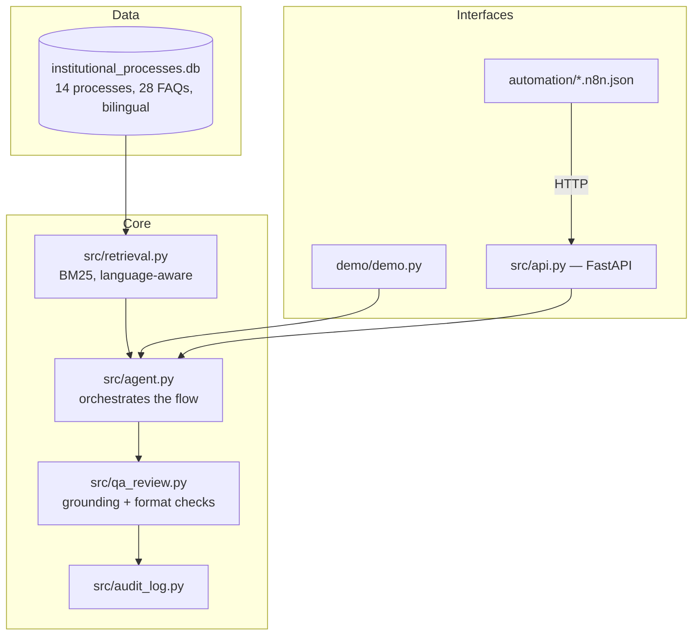

# Academic Process Copilot — Full Project Guide

A single, top-to-bottom walkthrough of the project — for two different
readers. **Part A** is for a student using the assistant: no technical
background assumed. **Part B** is for the developer/maintainer: setup,
architecture, and every design decision explained. The main
[README](../README.md) stays the short, portfolio-facing view; this is
the comprehensive one.

---

# Part A — For Students: How to Use This

## What this is, in plain words

A chat-style assistant that answers real questions about university
rules — things like "how many credit hours can I register?" or "how
long can I defer my studies?" — by looking the answer up in the actual
university regulation, not by guessing. You can ask in **English or
Arabic**, and it answers in whichever language you asked in.

## How to ask a question

- **Easiest way — the live website**: open the demo link in the main
  README, type your question in the box (English or Arabic), and press
  Ask. Nothing to install.
- If your institution deploys the API version, you'd ask through
  whatever front-end they put in front of it (a chat widget, a form,
  etc.) — the underlying question/answer mechanism is identical.

## Getting a good answer

- Ask about one thing at a time: "Can I withdraw from a course after
  week 8?" works better than a multi-part question mixing withdrawal,
  probation, and graduation together.
- Use the words the regulation itself uses where you can — "academic
  probation," "credit hours," "deferral" — though the assistant does
  reasonable matching even if your wording differs.
- If the first answer doesn't quite cover it, try rephrasing — retrieval
  matches on meaning-bearing words, so a different phrasing can surface
  a better match.

## What happens if it doesn't know

The assistant will tell you plainly that it couldn't find the answer in
the verified data, and point you to the responsible office — it will
**not** invent a plausible-sounding answer. This is a deliberate design
choice: a wrong guess about a real deadline or GPA requirement could
genuinely hurt you, so the system is built to refuse rather than guess.
If you see this happen, that's the system working correctly, not a
failure — the honest answer to "I don't know" is safer than a confident
wrong one.

## Every answer names where to verify it

Every answer ends with a line like "Verify with: Admissions and
Registration Deanship" (or "تحقق مع" in Arabic) — the actual office
responsible for that process. Treat the assistant as a fast first
lookup, and that office as the final word for anything that affects
your registration, grades, or graduation.

## Privacy

The assistant never asks for your name, student ID, or any personal
information, and it doesn't need any to answer a general regulation
question. What is logged is only the question text itself and whether
it was answered — never your identity, and never the answer text (see
Part B, Section 9, for the technical detail).

---

# Part B — For the Developer / Maintainer

## Concepts explained (plain language first, technical detail after)

If you're new to some of the terms this project uses, read this section
first — each technical section below assumes it.

**AI agent** — a program that takes a question, decides what
information it needs, fetches that information itself, and produces an
answer — as opposed to a chatbot that just replies from what it already
"knows" with no way to check a source.

**RAG (Retrieval-Augmented Generation)** — instead of asking an AI model
to answer purely from what it was trained on (which can be outdated or
simply wrong), you first *retrieve* the relevant real data yourself,
then hand that data to the model and say "answer using only this."
Retrieval is the "R," generation is the "G." This project's RAG pipeline
is diagrammed in Section 5.

**Hallucination / "grounded"** — hallucination is when an AI model
states something confidently that isn't actually true or actually
supported by its source data. An answer is "grounded" when everything
it claims can be traced back to real source data. This project doesn't
just *ask* the model to stay grounded — it automatically checks the
output afterward for numbers and citations that don't actually appear
in the retrieved data, and flags it if they don't (see step 6 in
Section 5's pipeline walkthrough).

**Structured prompting** — instead of one open-ended instruction
("answer this question"), the AI is given a fixed role, explicit rules
("only use the data below, say so if it's insufficient"), the actual
retrieved data, and a required output format. This is what makes the
output predictable and checkable rather than free-form.

**BM25** — the specific method this project uses to find which stored
question/answer pairs are actually relevant to a new question. It scores
documents by how many of the query's meaningful words they share,
weighted so rare, distinctive words count for more than common ones. It
does not require training a model or downloading anything — it's pure
counting/statistics, which makes it fast, free, and fully explainable
(you can always see exactly *why* a match was chosen).

**Bilingual retrieval (not translation)** — rather than storing one
language and translating the answer afterward, this project stores each
piece of content in *both* languages and searches only within the
language the question was asked in. An Arabic question can only match
Arabic-stored content. See the "Bilingual design" section of the main
README for the full explanation, including a real bug this approach
surfaced and fixed.

**No-code / low-code automation** — building an automated workflow
(e.g. "when X happens, do Y") by connecting visual building blocks in a
tool, instead of writing a program from scratch. This project uses n8n
(Section 7) to connect the AI agent to real triggers (a web request, a
schedule) without writing glue code by hand.

**API vs. CLI vs. website** — three different doors into the same
underlying logic. The CLI (command line) is for running it directly on
a machine; the API (a web service) is for other programs or the n8n
automation to call it; the published website is a self-contained,
browser-only copy of the same logic for anyone to try without installing
anything.

## 1. What this project is

Academic Process Copilot is an AI agent that answers student questions
about real UTAS academic-regulation procedures — registration, course
withdrawal, academic probation, study deferral, training/OJT, graduation
requirements, grade appeals, exam absence, transfers, and re-enrollment —
sourced from the actual UTAS Academic Regulation (Decision No. 612/2022,
Official Gazette No. 1468). It answers in whichever language the student
asked in (English or Arabic), never guesses when the data doesn't cover
a question, and every generated answer is checked against the data it
was retrieved from before being trusted.

It was built specifically to demonstrate every capability an
**AI-Enabled Academic and Administrative Support IT Technician** job
posting asked for — see the requirement map in the main README.

## 2. System overview



## 3. Getting started

```bash
git clone https://github.com/Safa-Alshukaili/academic-process-copilot.git
cd academic-process-copilot
pip install -r requirements.txt
python data/seed.py
python demo/demo.py
```

That last command runs both core flows end to end and prints every
stage — the retrieved context, the exact prompt, the answer, and the QA
verdict — so nothing is a black box.

### Running the full test suite

```bash
python demo/test_qa_review.py          # QA/grounding checks, including a forced failure
python demo/test_audit_and_freshness.py
python demo/test_add_faq.py            # the "closing the loop" flow
python demo/test_kpi.py
python demo/test_bilingual.py          # Arabic/English correctness, incl. a real bug fix
python demo/test_understanding.py      # paraphrase understanding + refusal cases
python demo/test_llm_selection.py      # LLM may only choose a record, never write text
python demo/test_gap_grouping.py       # similar unanswered questions merged
python demo/eval_retrieval.py          # accuracy / refusal numbers on labeled questions
python demo/demo.py                    # smoke test
```

All of these also run automatically in CI (`.github/workflows/tests.yml`)
on every push.

### Running the API

```bash
uvicorn src.api:app --reload
```

Open `http://127.0.0.1:8000/docs` for interactive Swagger documentation.
Endpoints:

| Endpoint | Purpose |
|---|---|
| `POST /ask` | Ask a process-guidance question (English or Arabic) |
| `POST /materials/draft` | Draft + QA-check an academic material |
| `GET /health` | Liveness + rolling QA failure rate |
| `GET /admin/freshness` | FAQ rows not re-verified in 180 days |
| `GET /admin/unanswered` | Failed questions, grouped by frequency |
| `GET /admin/unanswered/grouped` | Same queue, similar phrasings merged (used by the email digest) |
| `GET /admin/kpi` | One aggregated system-health view |

### Running with Docker

```bash
docker build -t apc . && docker run -p 8000:8000 apc
```

## 4. Using the agent

### From Python

```python
from src.agent import answer_question
answer, prompt_used, qa_passed = answer_question("What GPA puts me on academic probation?")
```

### From the API, in either language

```bash
curl -X POST http://127.0.0.1:8000/ask -H "Content-Type: application/json" \
  -d '{"question": "What GPA puts me on academic probation?"}'

curl -X POST http://127.0.0.1:8000/ask -H "Content-Type: application/json" \
  -d '{"question": "أي معدل يخليني تحت الملاحظة الأكاديمية؟"}'
```

Both return the same JSON shape: `{"answer": "...", "prompt_used": "...", "qa_passed": true}`.

### Using a real LLM (optional)

By default the agent runs with **no external API calls**. To add Claude:

```bash
export LLM_PROVIDER=anthropic
export ANTHROPIC_API_KEY=sk-...
```

The model is **not** allowed to write the answer. It receives the question
and up to three records that already passed the confidence gate, and must
reply with a record number or `NONE` (`prompts/templates.py::SELECTION_TEMPLATE`).
The student then sees that record copied verbatim from the database. Any
other reply — an explanation, an attempted answer, a number out of range —
is treated as `NONE` and the question is logged as a gap
(`demo/test_llm_selection.py` checks all of these with a stubbed model).
So with or without an LLM, every sentence a student reads comes from
`data/seed.py`. What the LLM adds is a second, stricter judgment of
*which* record answers the question — it can reject a candidate the
lexical gate let through.

## 5. The RAG pipeline, step by step

1. **Language detection** (`retrieval.py::detect_language`) — Arabic
   Unicode range present → Arabic; otherwise English.
2. **Normalization** (`text_normalize.py`) — applied identically to the
   question and to every document: Arabic orthography (hamza forms, ة/ه,
   ى/ي, diacritics, punctuation), light stemming (ال/و/ب prefixes, ات/ين/ـه
   suffixes; -s/-ed/-ing in English), article citations removed, and a
   small hand-written synonym table mapping same-meaning words to one
   concept ("postpone"/"defer", "الحرمان"/"أُحرم"/"انحرم", "مادة"/"مقرر").
3. **Scoring** (`retrieval.py::retrieve_scored`) — BM25 over FAQs and
   processes in that language only. FAQ questions count twice, since a
   student's wording resembles the question more than the answer. For
   each document it also reports how many of the question's terms it
   shares and what fraction (coverage) — terms that exist nowhere in the
   data still count against coverage.
4. **Confidence gate** (`agent.py::route_question`) — a record may answer
   only if it shares ≥2 terms and covers ≥60% of the question's terms.
   Otherwise the agent refuses and logs the question as a gap. The
   thresholds were tuned on `demo/eval_questions.py::DEV` only.
5. **Process narrowing** — if the chosen FAQ names a `process_id`, that
   process is fetched **directly by id** (`db.py::get_process`) rather
   than only filtered from the initial candidates. This fixes a second
   real bug: the correct process could be identified via the FAQ even
   when it didn't itself score into the top-k BM25 results.
6. **Rendering** — the chosen record is shown verbatim, prefixed with the
   matched question ("Closest verified question: …") so the student can
   see what was understood, followed by the process steps/forms, the
   other questions in the same process, and a "Verify with" line.
7. **Grounding check** (`qa_review.py::check_grounding`) — extracts every
   number and article citation in the answer and verifies each one
   actually appears in the retrieved context. Catches both English
   ("Article 46") and Arabic ("المادة 46") citation formats.
8. **Logging** (`audit_log.py`) — the question, what matched, and the QA
   verdict are logged (never the generated answer or any PII).

## 6. Closing the loop: what happens when the agent doesn't know

1. A question fails QA (or finds nothing) → logged to `audit_log`.
2. `GET /admin/unanswered` (or the n8n digest workflow) surfaces it,
   grouped by how often it's been asked — the most-asked gaps are the
   highest-value ones to close.
3. Staff verify the correct answer against the real regulation and run:
   ```bash
   python src/add_faq.py --question "..." --answer "..." \
       --verified-by "Registrar" --process-id 6 \
       --question-ar "..." --answer-ar "..."
   ```
   This inserts one row — it does **not** touch `data/seed.py` or wipe
   the database/audit history. The Arabic fields are optional: an FAQ
   added without them simply won't surface for Arabic questions until
   translated, rather than showing a broken or English-only answer to
   an Arabic query.
4. Every student asking that question afterward gets the verified answer
   automatically.

## 7. No-code automation (n8n)

Two real, importable n8n workflows in `automation/`:

- **`apc-student-inquiry.n8n.json`** — Webhook receives a question →
  calls `/ask` → branches on `qa_passed` → answers or escalates.
- **`apc-daily-digest.n8n.json`** — runs on a schedule (default: every 2
  days) → calls `/admin/unanswered` → sends one batched notification only
  if there's something new, instead of one alert per failed question.

Full setup, testing, and troubleshooting steps are in
[`automation/README.md`](../automation/README.md), including two real
issues hit while wiring this up live: Node.js resolving `localhost` to
`::1` instead of `127.0.0.1` (fixed by using `127.0.0.1` explicitly in
every HTTP Request node), and n8n only running while its own process is
alive (so a laptop going to sleep silently stops the schedule).

## 8. Testing philosophy

Every non-trivial behavior in this project has a test that would fail if
the behavior broke — including tests written specifically to prove a
*bug* is fixed, not just that the happy path works:

| Test file | What it proves |
|---|---|
| `test_qa_review.py` | The QA layer both passes good answers and **fails** a deliberately hallucinated one |
| `test_audit_and_freshness.py` | Logging and staleness detection work |
| `test_add_faq.py` | A gap can be closed without wiping the database — reproduces a real bug found mid-build (FAQ-only answers with no linked process were failing QA) and confirms the fix |
| `test_kpi.py` | The aggregated health view reflects a realistic mix of successes and repeated gaps |
| `test_bilingual.py` | Arabic and English don't cross-contaminate, and reproduces the process-narrowing bug fix |

## 9. Security & responsible AI

See [`docs/RESPONSIBLE_AI_AND_SECURITY.md`](RESPONSIBLE_AI_AND_SECURITY.md)
for the full policy. In short: PII is minimized by design (the
`stakeholders` table never stores names), prompt injection from
institutional data is stripped before it reaches a prompt
(`security.py::strip_prompt_injection`), and no AI-assisted output is
published without a human sign-off step — see
[`docs/QA_PROCESS.md`](QA_PROCESS.md).

## 10. Known limitations (stated, not hidden)

- Understanding is lexical plus a curated synonym table, not semantic.
  On the held-out question set (22 in-scope, 12 out-of-scope, was added before tuning): 19/22 answered from exactly the right FAQ,
  0/22 from an unrelated topic, 2/22 refused although answerable, and
  2/12 out-of-scope questions answered when they should have been
  refused. The most common error is picking a *sibling* FAQ in the right
  process ("how many withdrawals" vs "withdrawal deadline"); the listed
  related questions make that recoverable, not invisible. See
  `demo/eval_retrieval.py`.
- No admin UI — data is edited via script (`add_faq.py`), not a form.
- The API has no authentication layer.
- `src/materials.py` (academic material drafting) and the published
  client-side demo are English-only.
- n8n's schedule only fires while the n8n process itself is running —
  a real always-on deployment needs persistent hosting (n8n Cloud or a
  small server), not a laptop terminal.

## 11. Project structure reference

```
academic-process-copilot/
├── data/seed.py              # builds the database from real regulation data
├── src/
│   ├── db.py                 # connection + row-level lookups
│   ├── text_normalize.py     # Arabic/English normalization, stemming, synonym table
│   ├── retrieval.py          # BM25 scoring, bilingual, coverage signals
│   ├── gap_grouping.py       # merges similar unanswered questions
│   ├── agent.py              # confidence gate → verbatim answer → QA → log
│   ├── materials.py          # academic-material drafting flow
│   ├── qa_review.py          # QA checks, incl. grounding/anti-hallucination
│   ├── security.py           # prompt-injection stripping, PII redaction, RBAC stub
│   ├── audit_log.py          # logging + KPI aggregation
│   ├── freshness_check.py    # stale-data detection
│   ├── add_faq.py            # closes a gap without wiping the database
│   ├── api.py                # FastAPI service
│   └── prompts/templates.py  # structured prompt templates
├── automation/                # n8n workflows + their own README
├── demo/                      # CLI demo + full test suite
├── docs/                      # this guide, QA process, security policy,
│                               process-improvement analysis, screenshots
├── Dockerfile
└── .github/workflows/tests.yml
```
